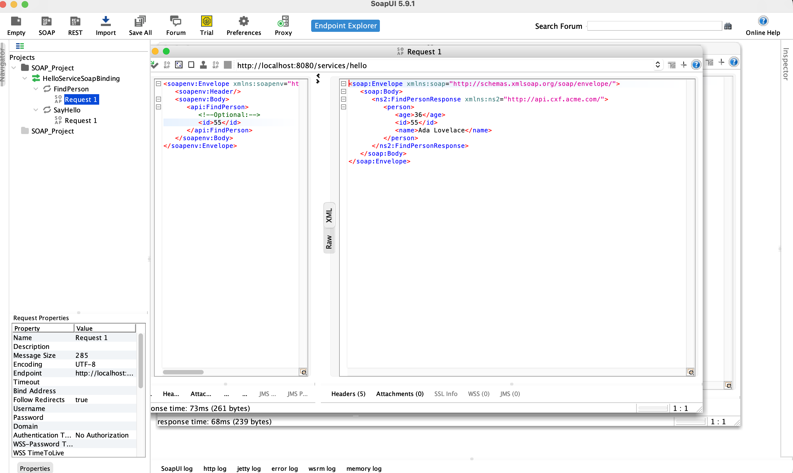

# Service SOAP avec Apache CXF

Service web SOAP sécurisé avec Apache CXF et JAX-WS.

## 🚀 Démarrage rapide

### Lancer le serveur
```bash
./start-server.sh
```

Le service sera accessible à : **http://localhost:8080/services/hello**

WSDL : **http://localhost:8080/services/hello?wsdl**

### Tester avec le client Java
```bash
./run-client.sh
```

## 🔐 Sécurité

- **Username** : `student`
- **Password** : `secret123`

## 📸 Tests avec SoapUI

### Projet créé


### Opérations disponibles


### Requête SOAP


### Réponse du service


### Configuration WS-Security


### Résultat avec authentification


## 📝 Opérations

### SayHello
- **Entrée** : String name
- **Sortie** : String greeting

### FindPerson
- **Entrée** : String id
- **Sortie** : Person (id, name, age)

## 🛠️ Technologies

- Apache CXF 3.5.5
- JAX-WS API 2.3.1
- WS-Security UsernameToken
- Java 11+

## 📚 Documentation

- [GUIDE_SOAPUI.md](GUIDE_SOAPUI.md) - Guide détaillé SoapUI
- [CHECKLIST_VALIDATION_FINALE.txt](CHECKLIST_VALIDATION_FINALE.txt) - Validation complète
- [SCENARIO_SOAPUI_SCREENSHOTS.txt](SCENARIO_SOAPUI_SCREENSHOTS.txt) - Scénario de test

---

**Auteur** : Projet SOAP avec Apache CXF  
**Date** : 2025
